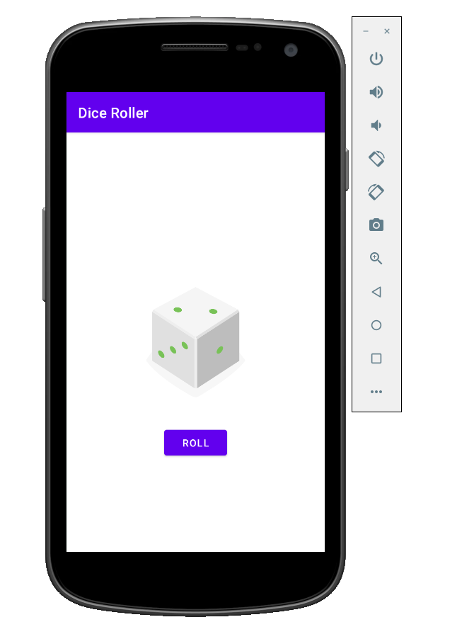
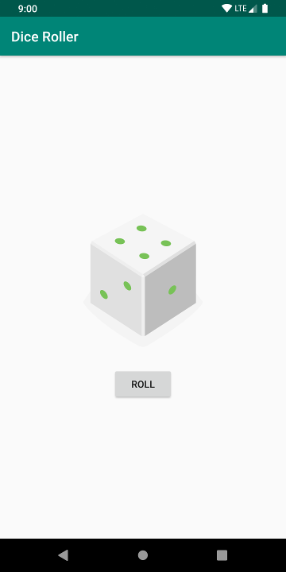

# Make your First App - Dice Roller

This is the toy app for lesson 1 of the [Android App Development in Kotlin course on Udacity](https://www.udacity.com/course/developing-android-apps-with-kotlin--ud9012) and also given by [Google's Android Basics in Kotlin program](https://developer.android.com/courses/android-basics-kotlin/course).

## Dice Roller

Dice Roller is a simple app that rolls a six sided die.

## Screenshots

